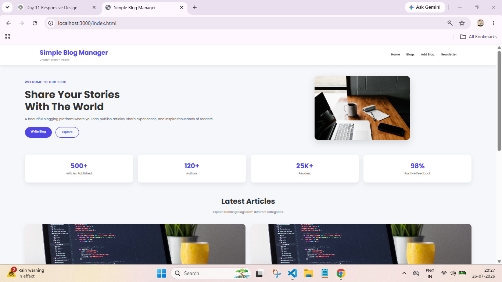
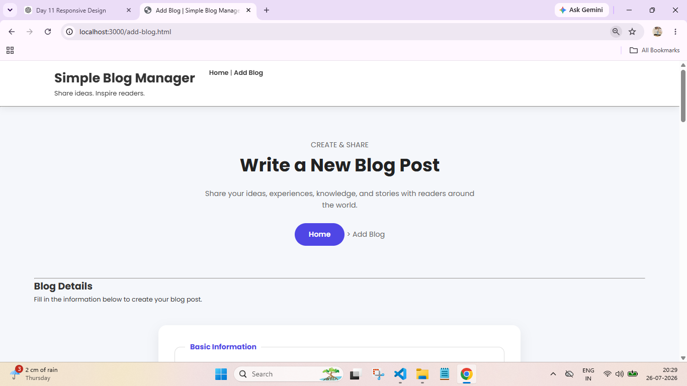
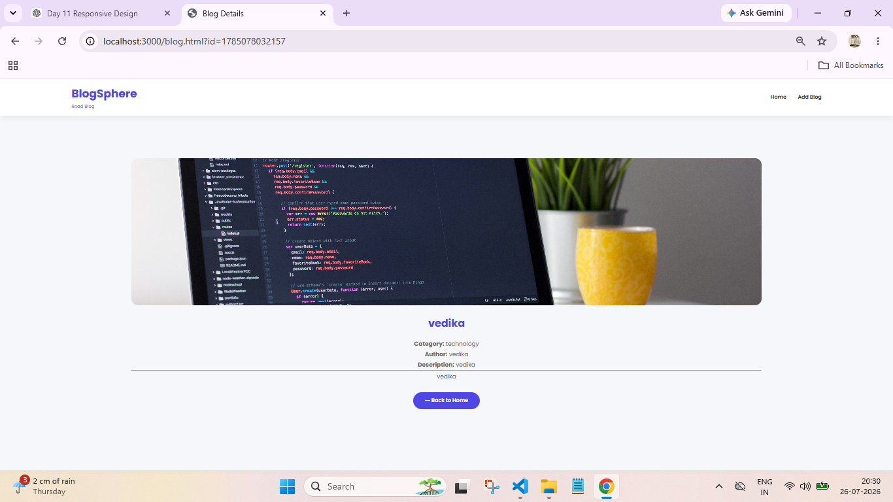
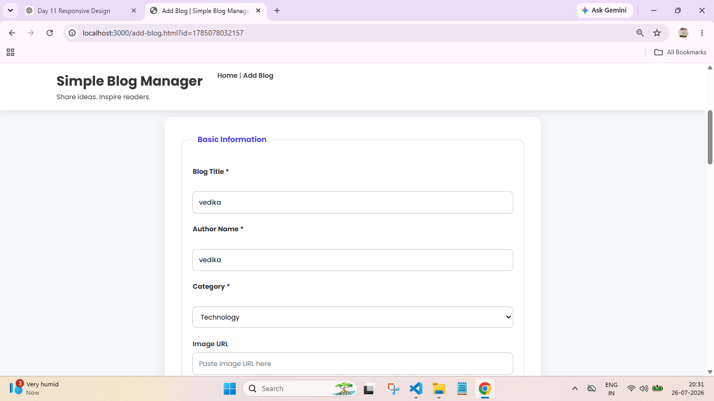

# 📝 Simple Blog Manager

A modern and responsive **Simple Blog Manager** web application built using **HTML, CSS, JavaScript, Node.js, and Express.js**. Users can create, view, edit, delete, and read blogs with a clean and user-friendly interface.

---

## 🚀 Features

- ➕ Add New Blog
- 📖 Read Full Blog on a Separate Page
- ✏️ Edit Existing Blog
- 🗑️ Delete Blog
- 📋 View All Blogs
- ✅ Form Validation
- 📱 Fully Responsive Design
- ⚡ Dynamic Blog Loading using Fetch API
- 🎨 Modern and Clean User Interface
- ⚠️ Error Handling and Loading Messages

---

## 🛠️ Technologies Used

- HTML5
- CSS3
- JavaScript (ES6)
- Node.js
- Express.js
- REST API

---

## 📂 Project Structure

```
Simple-Blog-Manager/
│
├── index.html
├── add-blog.html
├── blog.html
│
├── home.js
├── script.js
├── blog.js
│
├── style.css
├── server.js
├── package.json
│
├── images/
│
└── README.md
```

---

## ⚙️ Installation

### 1. Clone the repository

```bash
git clone https://github.com/vedikagirhe/simple-blog-manager.git
```

### 2. Open the project

```bash
cd simple-blog-manager
```

### 3. Install dependencies

```bash
npm install
```

### 4. Start the server

```bash
node server.js
```

### 5. Open in browser

```
http://localhost:3000
```

---

## 📸 Screenshots

### 🏠 Home Page



### ➕ Add Blog



### 📖 Blog Details



### ✏️ Edit Blog



## 📖 How to Use

1. Open the homepage.
2. Click **Add Blog**.
3. Fill in the blog details.
4. Publish the blog.
5. View blogs on the homepage.
6. Click **Read More** to read the full blog.
7. Edit or delete blogs whenever needed.

---

## 🌟 Future Enhancements

- 🔍 Search Blogs
- ❤️ Like Button
- 💬 Comments
- 👤 User Authentication
- 🖼️ Image Upload
- 📂 Category Filtering
- 🌙 Dark Mode

---

## 👩‍💻 Author

**Vedika Girhe**

- GitHub: https://github.com/vedikagirhe

---

## 📄 License

This project is created for educational and internship purposes.